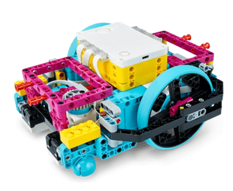
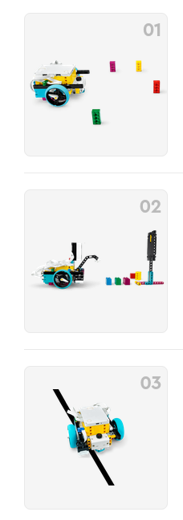

# unit prime set : Competition Ready

https://education.lego.com/en-us/lessons/prime-competition-ready/

 => 

## basic

* [1.drive around](./les1_driveAround.md)
* [2.object](./les2_object.md)
* [3.lines](./les3_lines.md)

## advanced

* [4.assemble](./les4_assemble.md)
* [5.custom code](./les5_customCode.md)
* [6.motorized tools](les6_tools.md)