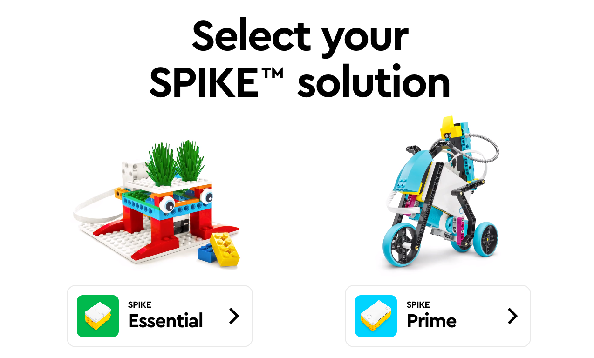
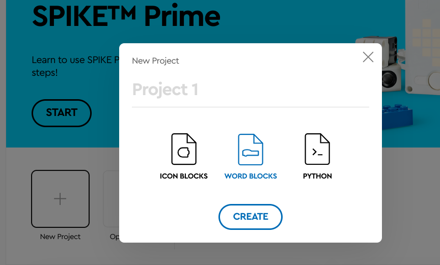
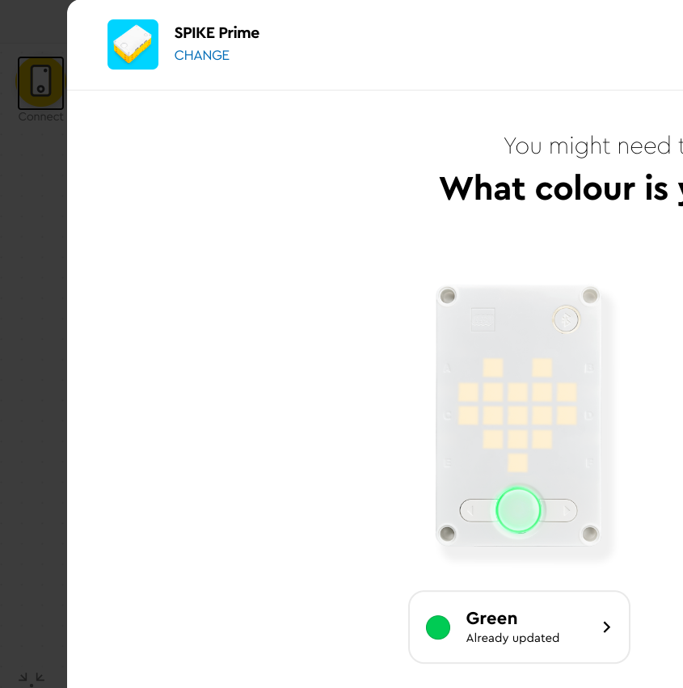
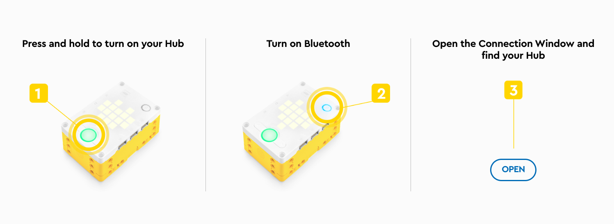
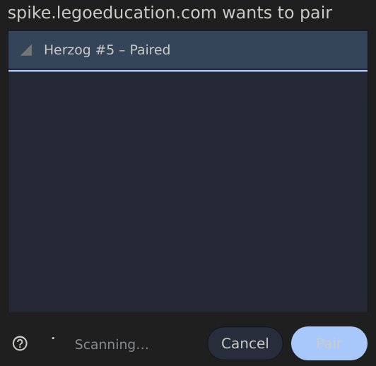
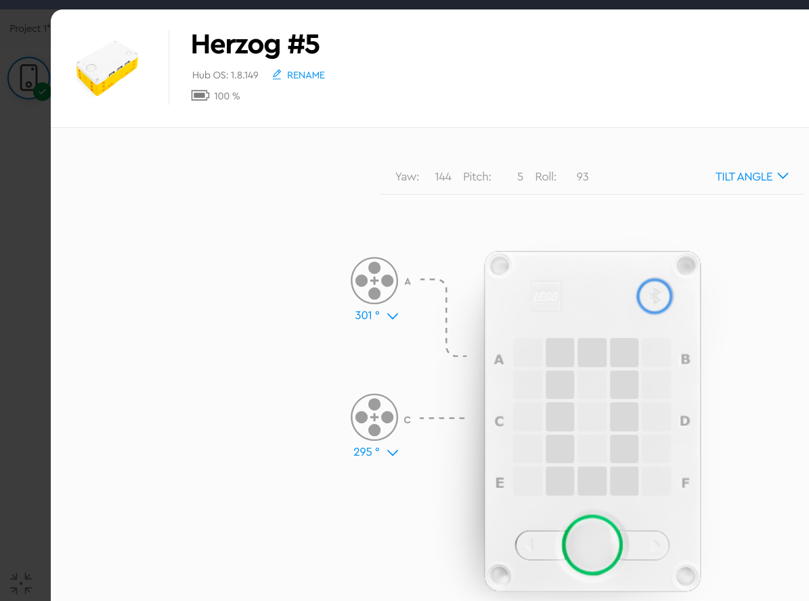

# spike app

* https://spike.legoeducation.com/#/prime/project

1 בחרו את הערכה שלנו 
PRIME

2 בחרו תוכנה לפי מילים ולא בלוקים

3 CONNECT לביצוע חיבור עם הבקר

4 הדליקו את הבקר לפי ההוראות

5 בחרו את הבקר שהתוכנה מזהה

6 בדקו מה מחובר בדיוק ולאיזו כניסה

