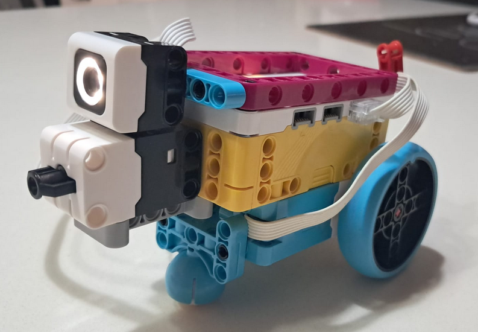
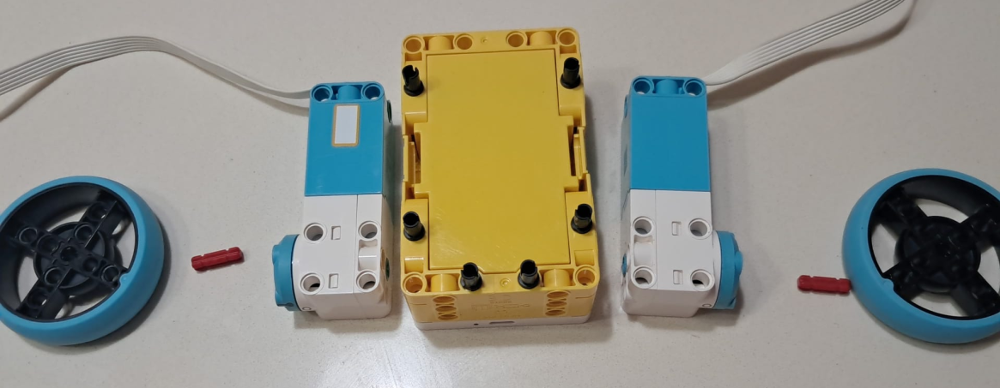
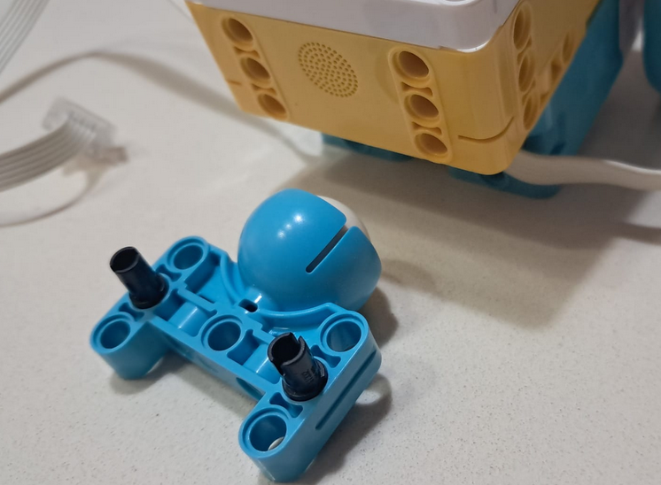
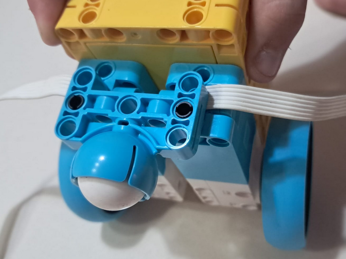
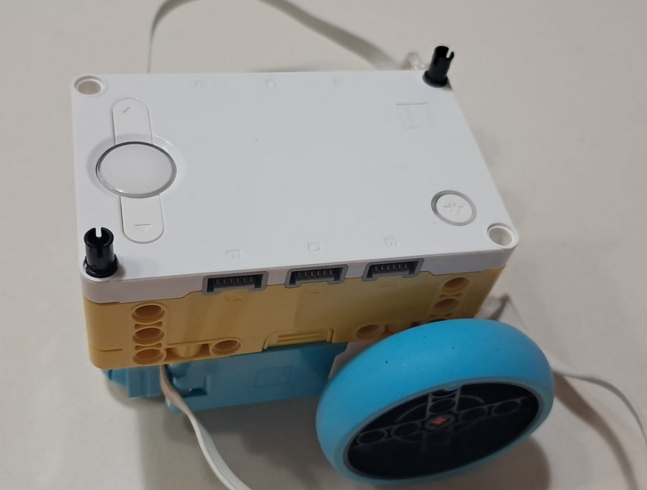
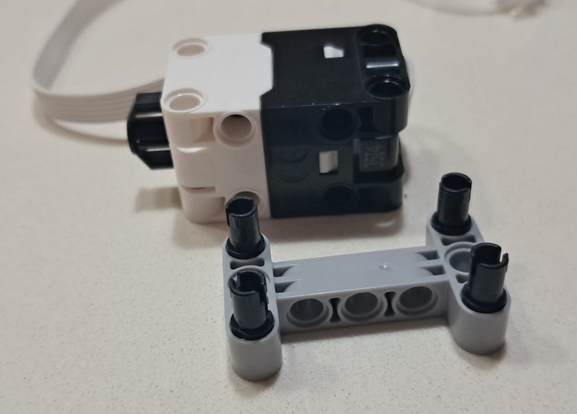
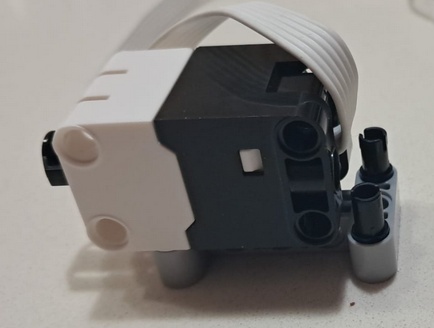
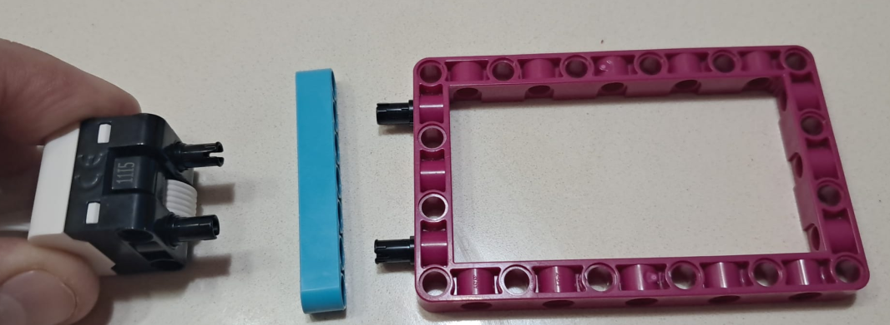
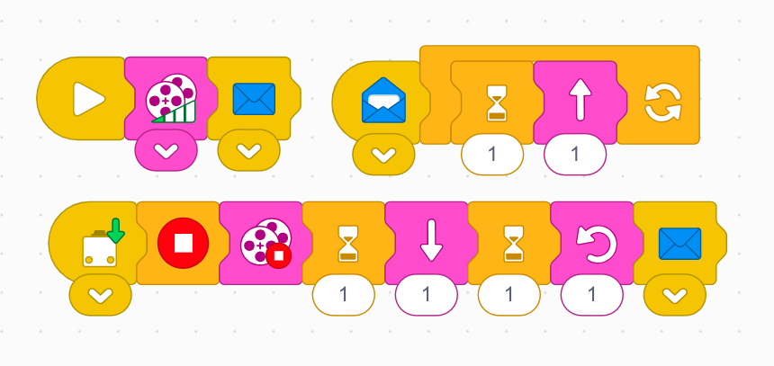

# מפיץ אור



## בניה










### כפתור לחיצה




### תאורה



חבר לחלק העליון


## sw

```
מטרה:
הרובוט יזוז לכל כיוון שבא לכם
ויאיר את האור לכל הסובבים
כשהוא יתנגש במכשול כלשהו 
הוא יסע אחורה
וישנה את כיוון התקדמותו
וימשיך לכיוון שתרצו
```



