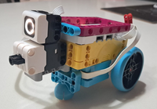
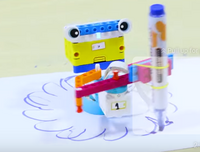

#  “משימת התקווה של רובוטי האור”

בימים האחרונים העיר שלנו צריכה הרבה אור, עזרה ותקווה.
למזלנו יש לנו צוות מיוחד – צוות רובוטי האור!

הרובוטים הקטנים של הצוות נשלחו למשימה מיוחדת:
לעזור לאנשים בעיר להרגיש בטוחים, מחוברים ושמחים יותר.

אבל כדי להצליח במשימה הם צריכים את העזרה של צוות החוקרים הצעירים (הילדים).

בכל שלב תעזרו לרובוטים לבצע משימה אחרת.
כל משימה תעזור לעיר שלנו להיות קצת יותר טובה.

האם אתם מוכנים להצטרף למשימת התקווה?

## אתגרים
* [רובוט מפיץ אור  ](./01_lighter/readme.md) 

* [רובוט מצייר  ](../../800_buildForFun/drawArms/readme.md) 