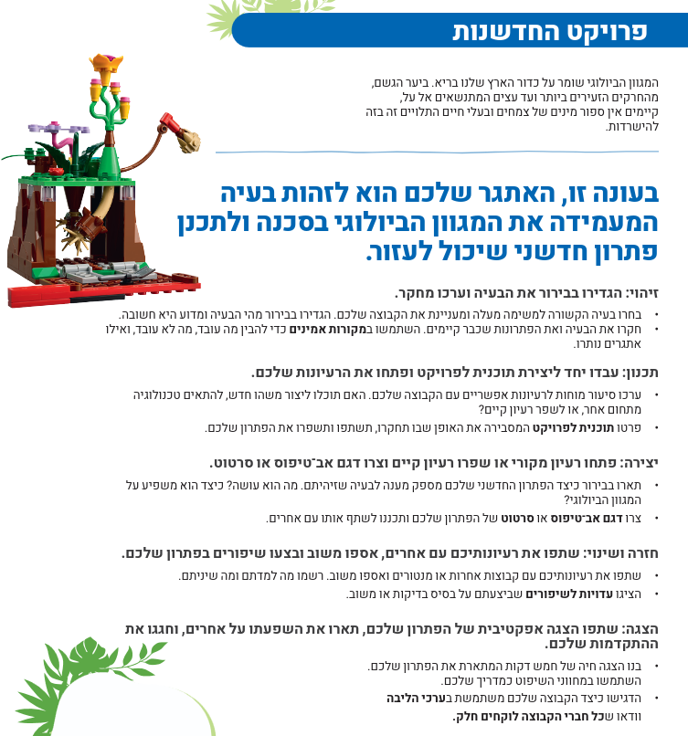

# 2027 bioglow year topic




* [examples](./examples.md)

## resources

https://firstinspires.blob.core.windows.net/fll/challenge/2026-27/fll-challenge-bioglow-multimedia-resources.pdf

https://greenschoolsireland.org/wp-content/uploads/2024/10/Biodiversity-Theme-Key-Words-Resource.pdf


## פרויקט החדשנות

```

הגדרת הבעיה
איזה מחקר נוסף נדרש כדי לבחון את הרעיון
מדוע הבעיה קיימת
מדוע חשוב לפתור אותה
מי יושפע אם הבעיה תפתר

איזה מחקר נדרש כדי ללמוד על פתרונות קיימים
כיצד הקבוצה תצור את הפתרון לפרויקט החדשנות

כיצד נתער את המחקר

מחקר הבעיה וחיפוש פתרונות קיימים

החליטו אם הקבוצה תציע פתרון חדש או תשפר פתרון קיים
בחרו פתרון לפיתוח

תכננו כיצד תפתחו פתרון לבעיה שבחרתם

אילו חומרים נדרשים לבניית אב טיפוס

צרו אב טיפוס או סרטוט מפורט של הפתרון

האם אתם יכולים לתאר את הפתרון בצורה שפשוטה להבנה לאחרים

עם מי אפשר לשתף כדי לקבל משוב

למי מיועד פתרון פרויקט החדשנות


תכננו את הצגת הפרויקט עי ידי כתיבת מבנה או תסריט

צרו כלי עזר חזורתי

כיצד יודעים אם הפתרון הולך לייצר השפעה חיובית על אחרים


```


## שיפוט
* [דף שיפוט](https://firstisrael.org.il/files/fll-challenge/qj8qf6FvjGEu7u/unearthed-judging-rubrics.pdf)